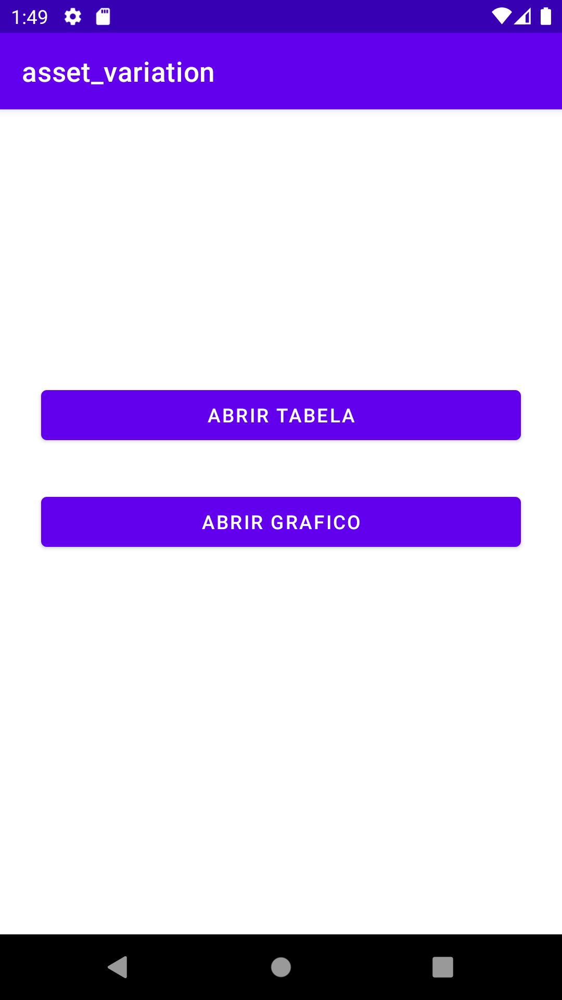
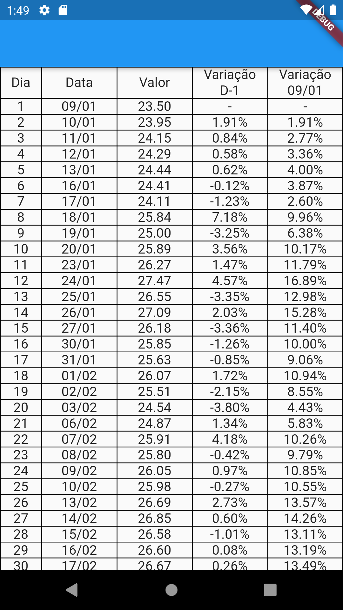

# Toro APP
## Rodar o projeto
Para rodar o projeto basta instalar o flutter (seguir passos da documentação oficial) em seguida clonar o projeto, e na pasta rais do projeto executar o comando flutter rum.

## Screens
Intro             |                       Login                       |                 
:-------------------------:|:-------------------------------------------------:
  | 
## Funcionalidades
- Tela de escolha
- Tela de tabela
- Tela do grafico

## Estrutura de pastas


```  
lib  
└───reference  
│   └───features  
│   │   └───feature1  
│   │   │   └───sub_feature  
│   │   │   └───data  
│   │   │   └───domain  
│   │   │   └───presenter  
│   │   └───feature2  
│   │  	│   └───sub_feature  
│   │  	│   └───data  
│   │  	│   └───domain  
│   │  	│   └───presenter  
│   app_module.dart  
│   app_widget.dart 
│   main.dart
```  
## Arquitetura do projeto
-   Clean Architecture
## Libs
- dartz:
  - Usado para auxilar no tratamento de erros.
- web_socket_channel:
  - Usado para conecções websocket
- mockito:
  - Usado para mocar os dados nos testes unitários
- flutter_bloc:
  - Principal gerenciamento de estado da aplicação
- get_it:
  - Injeção de dependências
- flutter_svg:
  - Usado para renderizar imagens svg

## Dispositivos usados nos testes
- Android:
  -  Moto G5
  -  Pixel 2 (Emulador)
- IOS:
  -  Não testado
